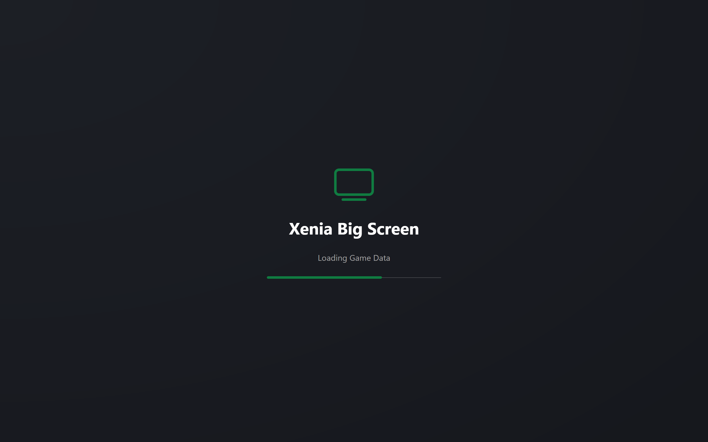

# Boot Sequence

How the app gets from process start to an input-ready Dashboard. Behind a splash screen, seven stages preload everything navigation needs so nothing waits on disk or network afterwards.

## Startup Order

1. Resolve paths and start logging, then build the service container. All services are singletons: background, profile, library, screenshot, modal, navigation, router, gamepad, main viewmodel, main window. Child viewmodels (header, Dashboard, settings, library, gallery) are built once inside the main viewmodel.
2. Load language while a background task quietly refreshes gamepad mappings into each installed emulator folder. Failures there log and are ignored.
3. Resolve the main window from the container. It goes fullscreen borderless, installs the splash screen, and subscribes to keys, gamepad, focus, pointer, navigation, and controller-state events.
4. On load, wire quit, refresh, and reveal events and forward current gamepad state. Views resolve from viewmodels by naming convention, with explicit templates for the few special cases.

## Boot Stages

Each stage reports progress, holds briefly, and is cancellable between steps. Input stays locked until Done.

| Stage | Load % | Unlocks |
|---|---|---|
| Settings | 10% | Correct shell paint, clock format, pinned controller |
| Profiles | 25% | Header identity |
| Dashboard | 35% | Recent-game cards with stats and artwork started |
| Library | 45% | Full card collection, stats resolved off the UI thread |
| Game data | 66% | Cached content, patches, achievements, artwork, details |
| Gallery | 85% | Populated thumbnail grid |
| Done | 100% | Initial focus, reveal animation, input unlock |

The reveal fades the header with the rows rising into place. A minimum splash time keeps fast machines from flashing it.

| { data-gallery="boot" } |
|---|
| Splash Screen |

## Session Cache

The game-data stage fills a static per-run store that hub panes then read from memory. The entries:

- Installed content scans, refreshed in place after deletes.
- Patch files with paths, refreshed in place after download or removal.
- Achievement files, dropped on profile switch since they are profile dependent. Content, patches, and configs survive a switch.
- Decoded artwork for recents and the current backdrop, swapped in with a crossfade when each decode lands.
- Library details from the online database, which the shared backend disk-caches daily. Missing entries are cached as missing and never refetched per selection.

Deliberately excluded: full per-game emulator configs, the costliest item. They load lazily when a settings pane opens or a launch needs them, which is the only accepted loader in the hub.

## Threading and Locks

All cache dictionaries sit behind one dedicated lock. Background preload threads write while UI readers read, and every access goes through the lock. Lifetime mutations (post-session clear, profile achievement drop, single-entry refresh) stay UI-confined so disposal ordering stays deterministic even though the lock protects the maps.

UI collections mutate on the UI thread only, after background work completes. Artwork decodes off thread and publishes back on it behind an in-flight guard, so rapid reselection converges instead of stacking duplicate decodes. The backdrop uses latest-wins cancellation: each new selection stops the in-flight fade, swaps, and fades in. Details fills stamp a monotonic generation counter and apply only when the generation is current and the same card is still selected, so a fast cursor never paints the wrong game.

## Safety Checks

- Corrupt or missing dashboard settings fall back to defaults. Boot never fails on settings.
- Games with no database entry cache the miss and show the unfilled panel state instead of retrying.
- Unreadable screenshot files warn and skip. The grid shows everything decodable rather than failing the scan.
- A missing full-resolution image in the viewer falls back to its thumbnail.
- Header network polling keeps the last known value on exception instead of flickering.
- Boot cancellation between stages aborts cleanly without partial UI state.

!!! warning "Stale keys"
    Cache entries key by game object identity, and a library reload replaces every game object. Post-session refresh must always clear before reloading and rebuilding cards. Never reorder that sequence.

## Invalidation

| Trigger | Handling |
|---|---|
| Game session ends | Clear all, reload library, rebuild cards, restore selection by game ID with fallback to first |
| Profile switch | Drop achievement data only, re-apply header, rebuild cards |
| Content deleted | Refresh that game's content entry |
| Patch downloaded or removed | Refresh that game's patch entry |
| Settings edits discarded | Reload that game's config and rebuild rows |
| Gallery opened | Rescan folders, preserve grid position, dispose old thumbnails |
| Clock format changed | Re-render capture dates without rescanning |
