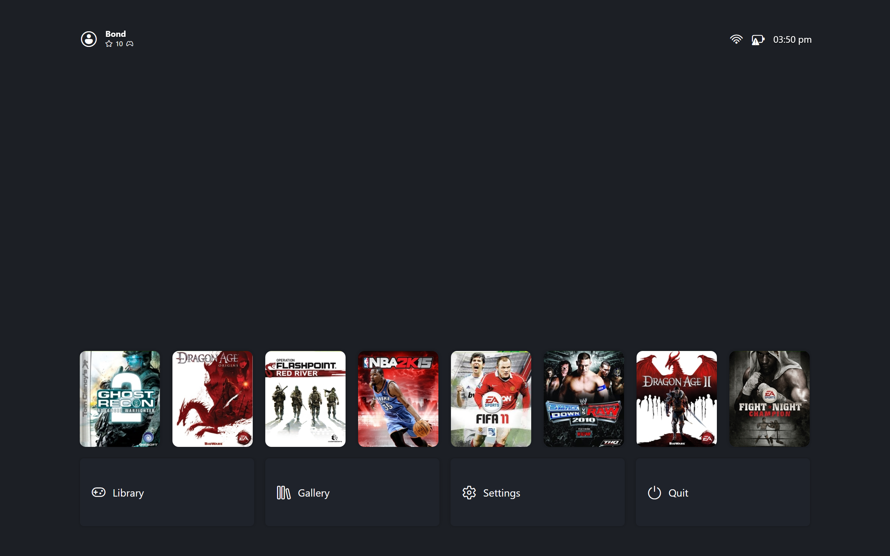

# Dashboard

Home. Recent games in a row, options beneath them, and status across the top. It is always alive underneath whatever is open, and every flow returns to it.

## Header Row

Profile chip on the left, network, battery, and clock on the right. Selecting the chip opens the profile picker. The clock follows your 12 or 24-hour setting. The profile shown can rotate across versions when enabled; that only changes the display, never the active profile.

## Recent Games

Recent games first, most recently played first. Moving along the row grows the focused card while neighbours settle, keeping total row width constant so the layout never jumps. Selection against no selection:

| { data-gallery="dashboard" } |
|---|
| Game Selected |

| { data-gallery="dashboard" } |
|---|
| No Game Selected |

Confirm launches the focused game. Details opens its page. An empty library shows a stub instead of the row.

## Backgrounds

The backdrop follows the selected game. Picking a new card crossfades the artwork instead of swapping it: the old art fades out, the new art fades in, and a newer selection cancels whatever is still fading. With no art to show, the backdrop falls back to the configured gradient or solid colour. A vignette darkens the edges over images.

| { data-gallery="settings" } |
|---|
| Solid Background |

| { data-gallery="settings" } |
|---|
| Linear Gradient Background |

| { data-gallery="settings" } |
|---|
| Radial Gradient Background |

## Options Row

Fixed actions under the games: Library, Gallery, Settings, Quit. Moving between the rows preserves your column, so going back up lands on the same game. Quitting returns to the desktop Manager when configured that way, otherwise it closes everything.
