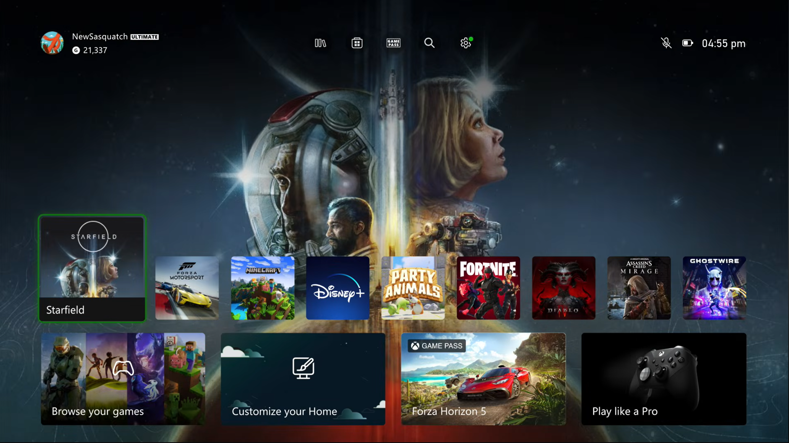
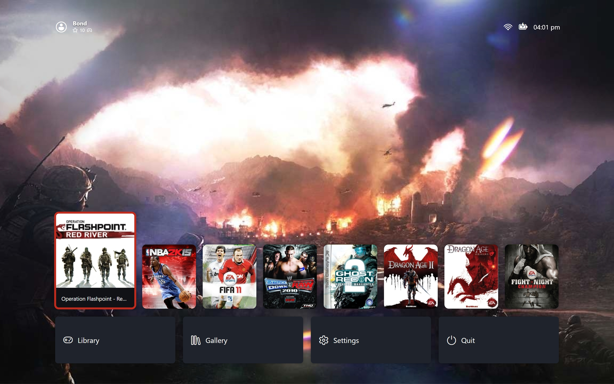
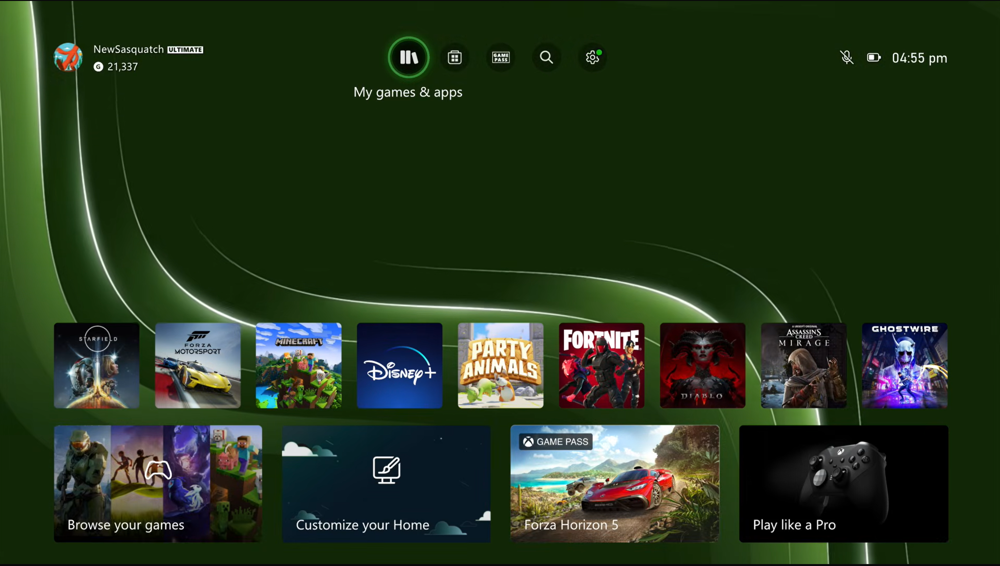
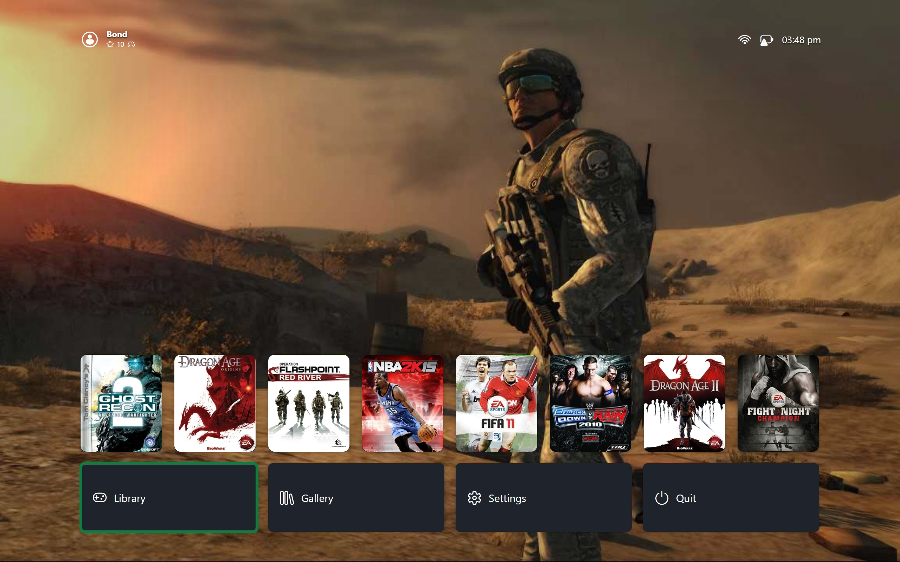

# Design Philosophy

BigScreen recreates the feel of a modern console on your TV. These are the rules every screen follows.

## One Focus

Exactly one thing is highlighted at all times. Move and the highlight moves. Confirm and it acts. Back and it steps out. Focus is never lost: closing anything returns you to where you came from.

| { data-gallery="selection" } |
|---|
| Xbox Series - Game Selected |

| { data-gallery="selection" } |
|---|
| Big Screen - Game Selected |

The selected card grows while its neighbours settle. Nothing else on the row changes size or position. Same moment with nothing selected:

| { data-gallery="selection" } |
|---|
| Xbox Series - No Game Selected |

| { data-gallery="selection" } |
|---|
| Big Screen - No Game Selected |

## Readable From the Sofa

One headline, one focused row, generous spacing. Body text never competes with artwork. If a screen needs a paragraph to explain itself, the layout is wrong.

## No Waiting

Anything already on disk responds instantly. Opening a screen, sorting a list, or previewing a pane never shows a loader for local data. The slow work happens once at boot behind the splash screen. See Boot Sequence.

## Gamepad First

Every action is reachable on a controller through a fixed vocabulary: move, confirm, back, start, sort, details, switch view. Mouse and keyboard mirror all of it but never unlock anything extra. Typing in a text field pauses keyboard routing, except Escape, which always exits; gamepad input still routes.

## Forgiving by Default

Deleting anything always confirms first. Editors snapshot the original value on entry: confirming keeps it, backing out drops it without side effects. Leaving with unsaved edits asks to save, discard, or stay. No flow destroys data on a misclick.
