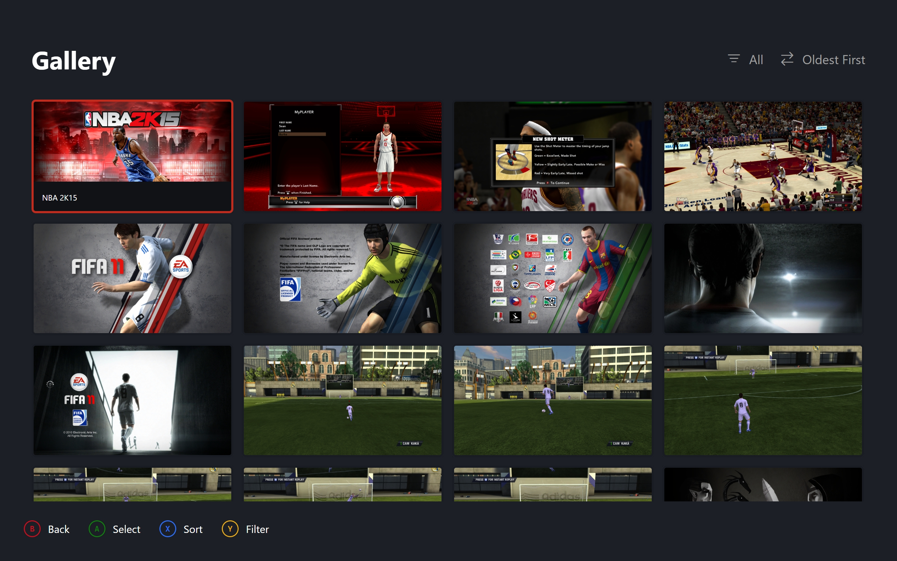
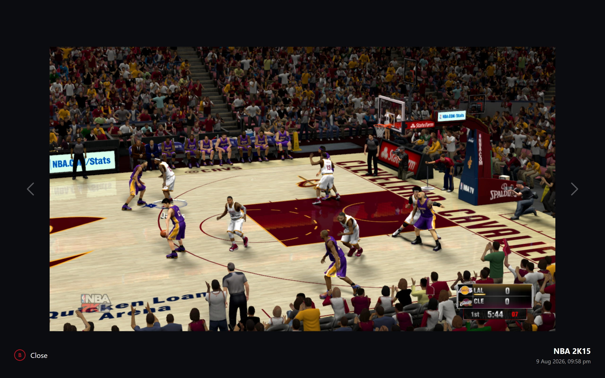

# Gallery

Screenshots across installed versions, gridded as thumbnails and viewed full resolution one at a time.

## Grid Contents

| { data-gallery="screenshots" } |
|---|
| Thumbnail Grid |

Sort defaults to newest first. Filters hold All plus one entry per installed version. Sort and filter preserve grid position.

| Sort | Order |
|---|---|
| Newest | Capture time descending |
| Oldest | Capture time ascending |
| By Game | Title ascending, capture descending within a game |

Sort cycles in that order on Sort. The filter wraps All through each version on Details. Both preserve grid position. Boot loads once under the splash stage. Every open refreshes with the same scan.

## Scan

Per installed version, resolve the screenshot folder and return early when absent. Custom builds are never scanned. Per file: folder wins when it is a full game ID, else the filename prefix. Unreadable files skip. The list replaces on every load.

## Filename Format

`{GAMEID} - {yyyy-MM-ddTHH-mm-ss}.png`, so identity and date survive
copy and move. Anything else falls back to write time.

## Grid Geometry

Fixed columns of uniform 16:9 cells. Thumbnails decode smaller than full resolution. Shared by the Gallery and the per-game pane.

## Viewer

One full-resolution image alive at a time, thumbnail fallback when unreadable. Left and Right step with gallery selection in sync, Back closes. Own opaque backdrop.

| { data-gallery="screenshots" } |
|---|
| Screenshot Viewer |

## Per-Game Pane

Borrows shared thumbnails when the cache holds them, otherwise scans the folder itself. Activate opens the shared viewer over the rows.
