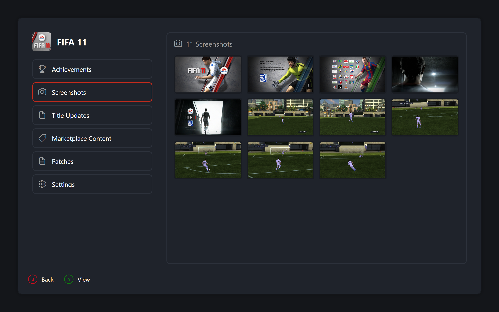

# Game Details

Selecting a game opens its details modal: game icon and title over an options list on the left and a live preview pane on the right. Fixed options in order: Achievements, Screenshots, Title Updates, Marketplace Content, Patches, Settings.

## Options List

Moving between options swaps the right pane immediately. Panes are created once per modal and cached for revisits.

## Single Highlight

Exactly one column is highlighted at a time. Entering a pane selects its first row. Exiting reselects the current action.

Input goes to the pane first. Back and Left still fall back to leaving. Up and Down move with live swaps, Activate and Right enter, Back closes the modal.

Hints refresh on every pane change. The X hint names the pane's X action. The A hint names Activate per pane.

## Achievements

Unlocked-over-total plus gamerscore counters. Sort by completion, gamerscore, or name. Empty state with zeroed counters when the game has none.

| { data-gallery="details" } |
|---|
| Achievements |

## Screenshots

The game's own folder grid in the same geometry as Gallery. Activate opens the shared viewer over the pane rows. See Gallery.

| { data-gallery="details" } |
|---|
| Screenshots |

## Title Updates and Marketplace Content

Installed headers with counts. Activate confirms, deletes from disk, and refreshes the entry. Decline aborts untouched.

## Patches

Download row, one row per entry, remove row only when installed. Entries toggle in place with immediate save. Download stacks the search modal and refreshes on return. Removal confirms first.

## Settings Pane

Toggles flip, sliders step directly, choices open a small editor. Saving writes the file. Backing out dirty prompts save or discard.

## Disc Selector

One card per disc, invalid discs skipped. Confirm returns the number, Back aborts the launch.

## Game Launch

Same steps from details, Dashboard, and Library:

1. Resolve the disc. Single-disc uses last played. Multi-disc prompts. Cancelling aborts with nothing written.
2. Force fullscreen through the cached game config when the setting is on and the version is managed, saving the prior value.
3. Ensure the active profile, restoring the persisted one on drift. Inject it into the launch slot and sync the default system profile.
4. Disable the window and launch through the shared game launcher with a fresh settings object and the disc number.
5. Always on return: restore fullscreen, re-enable input, clear the session cache, reload the library, and rebuild cards preserving selection by game ID.
