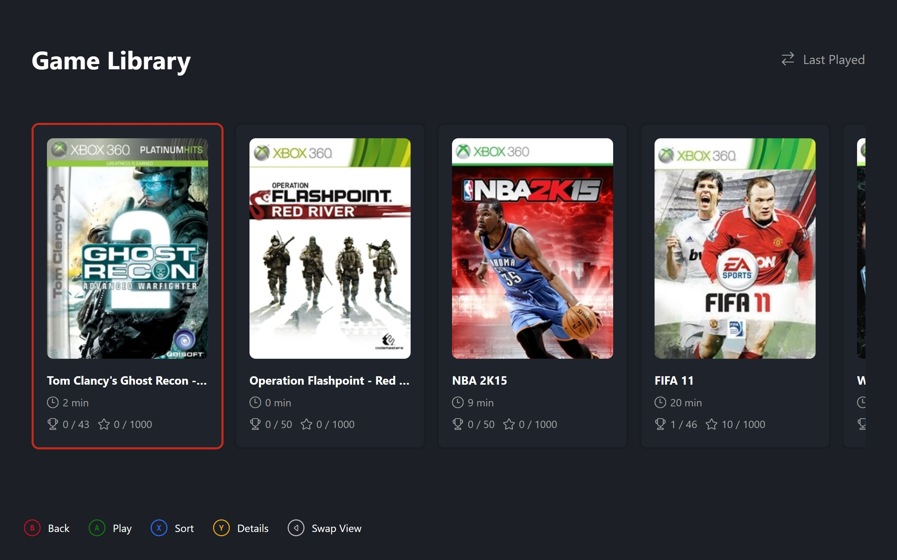
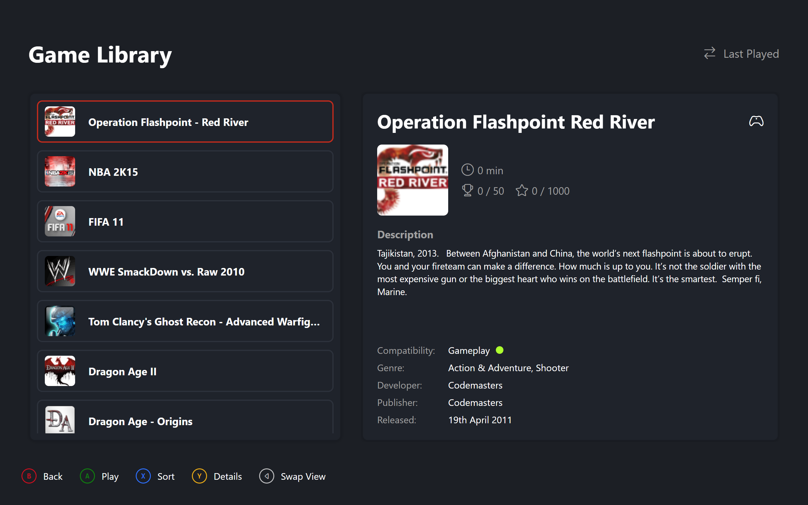

# Library

The game collection in two views sharing one card collection and one selection. Both views live in the same file and flip on visibility, so switching layouts is instant.

## Carousel View

A horizontal card strip, top-aligned in a hidden-scrollbar scroller. Box art at the top, title below it, then a playtime row and an achievements-plus-gamerscore row. Selection flips the card border from neutral to accent at the same thickness.

The scroller centres the selected card on horizontal moves, sort changes, restores, and mouse clicks. An empty collection shows a stub with an icon and message instead of the strip.

| { data-gallery="library" } |
|---|
| Carousel View |

## List View

A two-column grid. The left column is a bordered card holding a vertical list of rows inside a hidden-scrollbar scroller. Each row is a button: disc art beside the title. The border accents on hover, keyboard focus, or selection.

The right column is the details panel for the selected game, shown only while a selection exists. The empty stub spans both columns when the collection is empty.

| { data-gallery="library" } |
|---|
| List View |

## Sorting

| Order | Key |
|---|---|
| Alphabetical | Title, case insensitive |
| Time Played | Playtime descending |
| Last Played | Timestamp descending |

Cycles in that order on Sort, with the current order shown beside a rotated sort icon in the header. Sorting keeps the same viewport index rather than tracking the element, so the list never jumps, then re-centres the scroll on the new position.

The layout follows the persisted setting live, so Dashboard recents and Library stay consistent. Toggling flips the stored value, and changing it re-posts the scroll for the newly shown view.

## Cards

Each card wraps one game with selection state, artwork mode, and an optional stats record defaulting achievement and gamerscore text to zero over zero with playtime formatted from minutes.
