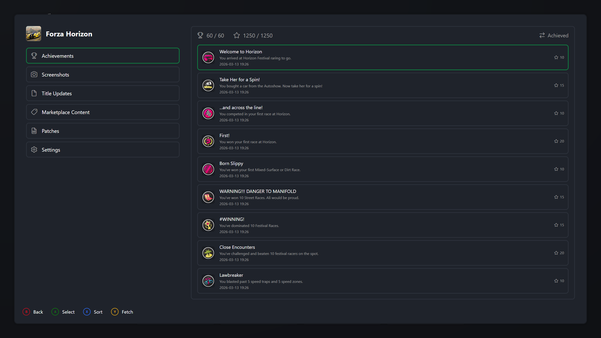
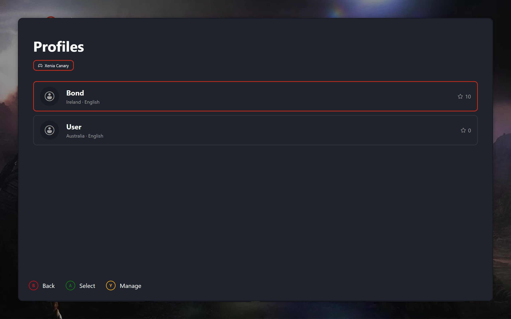

# BigScreen

BigScreen is the fullscreen, controller-first interface for Xenia Manager. It puts your game library on the TV: browse games from the sofa, check achievements, manage profiles, and launch, all with a gamepad. Keyboard and mouse work throughout, but every action is reachable on a controller.

## Dashboard

Home. Your most recently played games in a row, Library, Gallery, Settings, and Quit beneath them, and your profile, clock, network, and controller status across the top. Selecting the profile chip switches profiles. An empty library shows a stub pointing you at adding games on desktop.

| { data-gallery="overview" } |
|---|
| Box Art View - Game Selected |

## Library

The full collection in two layouts. Carousel is a horizontal art strip for browsing. List pairs compact rows with a details panel showing description, compatibility, and metadata. Sort cycles alphabetical, playtime, and last played. Confirm launches the selected game.

| { data-gallery="overview" } |
|---|
| Library - Carousel View |

| { data-gallery="overview" } |
|---|
| Library - List View |

## Game Details

Pressing Details on any game opens its page: Achievements with progress and sorting, Screenshots from that game, Title Updates and Marketplace Content with delete, Patches with download, toggle, and remove, and Settings with the curated emulator options for that game. Multi-disc games ask which disc to play on launch.

| { data-gallery="overview" } |
|---|
| Game Details - Achievements Pane |

## Gallery

Every screenshot from every installed version in a uniform grid. Sort by newest, oldest, or game, and filter by version. Opening one shows it fullscreen with stepping through the current filter.

| { data-gallery="overview" } |
|---|
| Gallery - Thumbnail Grid |

## Profiles and Settings

The picker switches your active profile per emulator version. Management creates, renames, configures, deletes, imports, and exports profiles, and always confirms before anything destructive. Settings covers layout, artwork style, clock, background, controller, quit and fullscreen behaviour, and display resolution per version.

| { data-gallery="overview" } |
|---|
| Profiles - Profile Picker |
