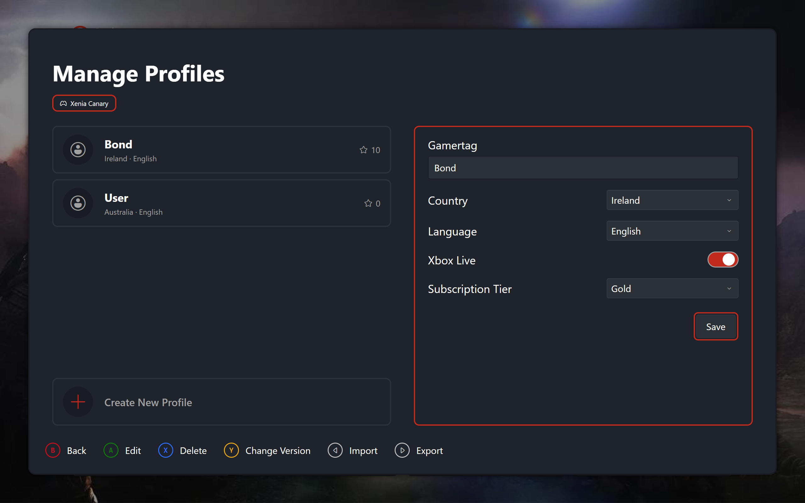

# Profiles

Two screens over one per-version profile store. The picker selects. Management edits. The picker stacks management on top and reloads when it closes.

## Profile Picker

Opened from the profile icon at the top left of the dashboard, displays the list of profiles for the user to choose from.

| { data-gallery="profiles" } |
|---|
| Profile Picker |

## Manage Profiles

Accessed through the profile picker, the manager allows you to modify, delete and create new profiles for the current Xenia version you are using. Does not save automatically so a confirmation modal appears if you try to back out with unsaved changes.

| { data-gallery="profiles" } |
|---|
| Manage Profiles |

## Unsaved Changes

A baseline record snapshots every editable field on each profile load. The dirty flag compares live values against it, refreshed on each change alongside re-validation. Exiting, switching versions or rows, creating, or closing with unsaved edits pushes the save-or-discard prompt: confirm saves, decline discards, dismiss stays.
