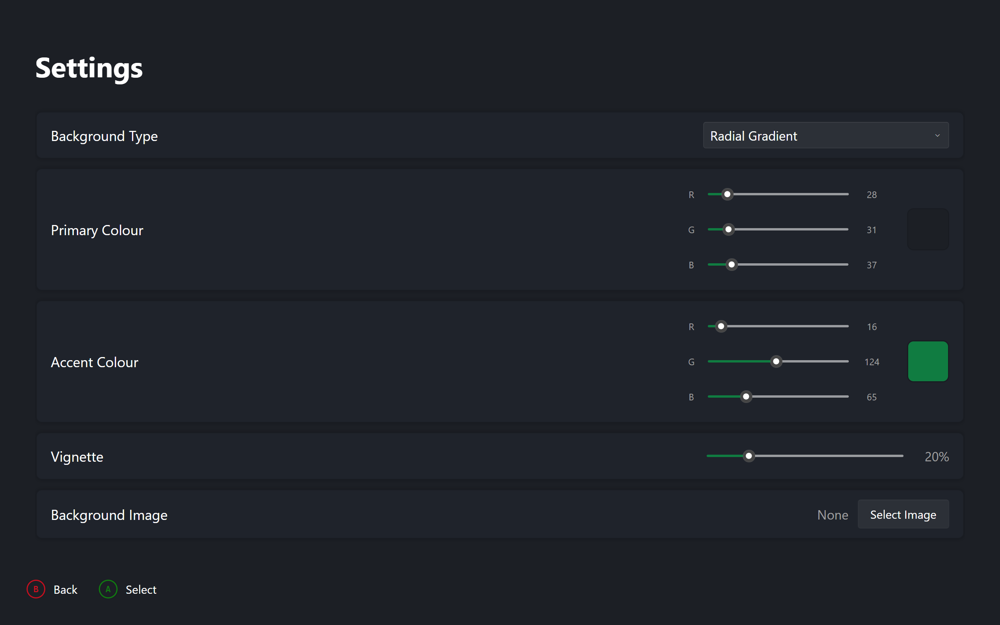
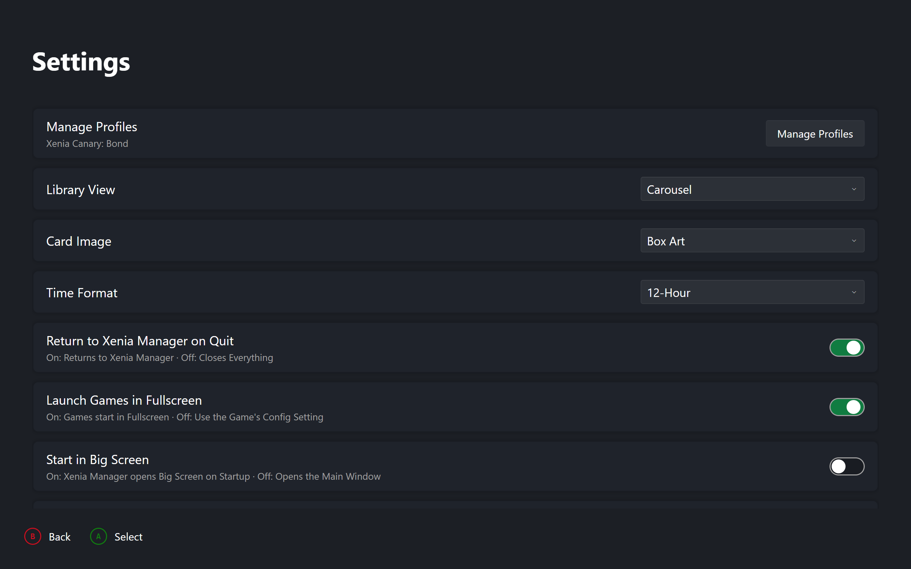

# Services and State

The background pieces BigScreen runs on: the session cache, settings storage, profiles, and screenshots. Anything outside this project shows up only as something BigScreen needs. Those systems carry their own docs.

## Session Cache

BigScreen reads each game's files once at boot and serves the screens from memory after that. The entries:

| Entry | Loaded | Refreshed |
|---|---|---|
| Game config | When first needed. Left out of boot on purpose as the slowest item | Reloaded for one game when settings edits are discarded |
| Installed content | Boot | That game only, after a delete |
| Patch file | Boot | That game only, after download or removal |
| Achievement data | Boot | Dropped on profile switch. Content, patches, and configs survive a switch since they do not depend on the profile |
| Preload pass | Boot, one game at a time with timing logs | n/a |

After every game session the whole cache clears. It has to: reloading the library replaces every game object the cache keys off, so old entries would point at dead objects.

!!! warning "Clear before reload"
    Post-session refresh must always clear the cache before reloading the library and rebuilding cards. Never reorder that sequence.

## Library Service

Hands out the game list with no copy, reloads it from disk, and answers most-recently-played queries with title tiebreaks so unplayed games sink to the tail.

## Screenshot Service

Holds the thumbnail list plus a full rescan. Walks installed versions only; custom builds are never scanned. Per file it takes the parent folder as the game when valid, otherwise reads the filename, stamps the capture time from the name with write-time fallback, matches the title against the game list, and decodes a thumbnail. Bad files warn and skip. The list replaces wholesale on every load. Format and grid detail is in Gallery.

## Background Service

Owns dashboard settings, saved as JSON under the app config folder. A missing or corrupt file keeps defaults, so boot never fails on settings. Saving re-applies everything live. Backgrounds resolve by mode: a chosen image file, a solid colour, gradients derived from the primary colour, or the selected game's artwork with a gradient fallback. The image bitmap is reused while the path stays the same.

## Dashboard Settings

| Setting | Default | Effect |
|---|---|---|
| Background mode | Dynamic artwork | Which backdrop source paints |
| Image path | empty | File used only in image mode |
| Primary colour | dark slate | Solid colour and gradient base |
| Accent colour | Xbox green | Selection border and accents |
| Vignette strength | low default | Edge darkening, zero reads as off |
| Return to Manager | true | Quit relaunches the desktop app when present |
| Fullscreen launches | true | Forces fullscreen per session, restores after |
| Library layout | Carousel | Followed live by Dashboard and Library |
| Card artwork | BoxArt | Flips every card live |
| Clock format | TwelveHour | Header clock and capture dates |
| UI scale | 100 | Interface size (25–200%) |
| Pinned controller | absent | Hardware ID restored at boot |
| Active profiles | empty | Saved profile per version, restored at boot |
| Active version | absent | Version driving header and pickers |
| Profile rotation | true | Header cycles displayed identity. Display only |

## Profile Service

Tracks one active profile per emulator version and remembers them between runs. Loading reads each installed version and picks the saved active, or the first populated version. Refresh re-scans after outside changes and keeps the old active when still valid. Switching rejects unmanaged builds and unknown profiles, then activates, saves, and notifies. Before every launch it re-checks the active profile and restores the saved one on drift.

Stats come from the profile file first with the per-game file as fallback. Scores sum unlocked values. The default system profile, language, and country sync on every activation and before every launch, writing only on change. Shared folders load once from the first version and fan active writes to all versions.

## Settings Screen

Top to bottom: profile management with one status line per installed version, library layout, card artwork, clock format, UI scale, session toggles, background and appearance controls with the image picker, one row per connected controller, and Xbox version and resolution rows only when a system config file exists.

| { data-gallery="settings" } |
|---|
| Theme Preferences |

| { data-gallery="settings" } |
|---|
| User Preferences |

Opening a row snapshots the original value. Choices cycle in place. Colours step channels or the palette. Sliders adjust directly with no editor. Confirming keeps the change, backing out drops it. Backing out of colours keeps the work rather than losing it; backing out of choices restores the snapshot. The image row opens the file picker and switches mode on selection.

Dashboard settings save on every change and apply live. The start toggle writes straight through to the shared desktop config. Xbox resolution writes the per-version system file. Per-game emulator rows save explicitly and reload from disk on discard.
