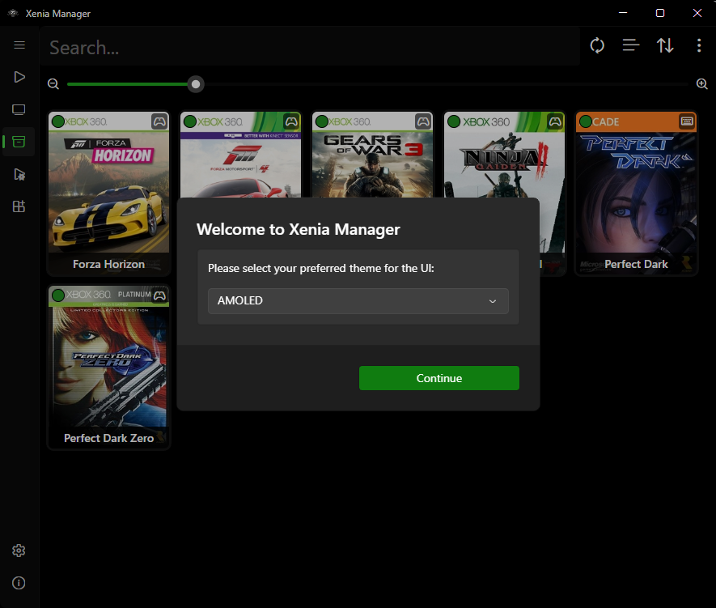
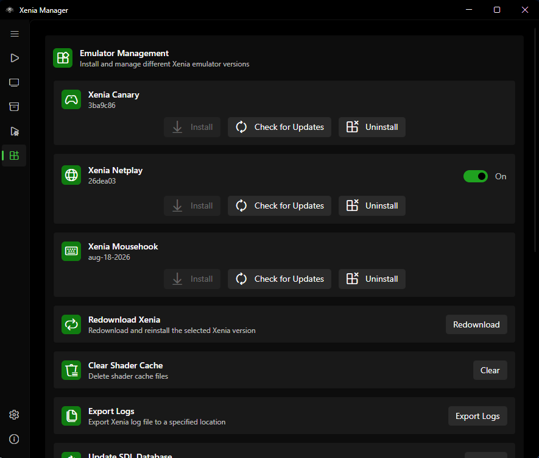
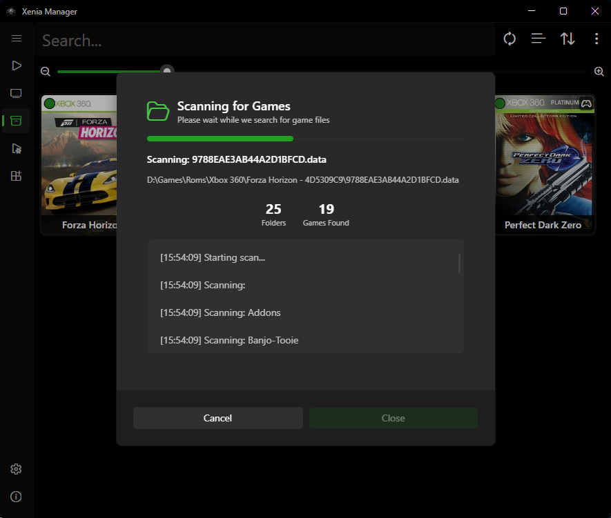

# Quickstart

This guide takes you from a fresh install to launching your first game. It assumes you already completed [Installation](installation.md).

---

## 1. Launch Xenia Manager

Run `XeniaManager.exe`. On the very first startup the app creates its `Config/` folder - `Games/`, `Logs/`, `Cache/`, and `Emulators/` appear as needed (library load, logging, artwork downloads, emulator installs) - and shows the main window with an empty Library.

If the window is blank, that is normal - you have not installed Xenia or added games yet.

## 2. Install Xenia (1-Click Setup)

1. Open the **Manage** page (sidebar → Manage).
2. Pick a variant to start with: **Xenia Canary** is the recommended default. Add **Mousehook** if you want keyboard-and-mouse support, **Netplay** if you want online multiplayer.
3. Click **Install** for that variant. The Manager downloads the build (Netplay offers stable or nightly channels, Mousehook offers Standard or Netplay channels - see [Manage Xenia](../guides/manage-xenia.md#stable-vs-nightly-netplay-only)) into `Emulators/<Variant>/`.
4. Wait until the version label shows an installed version number instead of "Not Installed".

!!! tip
    Leave **automatic update checks** on (default). The Manager will badge the Manage page when a newer Xenia build is available. Details in [Manage Xenia](../guides/manage-xenia.md#updates).

## 3. Add Games to the Library

1. Place your legally owned Xbox 360 dumps where you want them (the default `Games/` folder next to the executable works, or any folder you prefer).
2. Open the **Library** page → **Options** (or Library settings) → **Scan Directory** and point it at your games folder.
3. The Manager parses each file (ISO, XEX, STFS/SVOD, ZAR, and similar Xbox/Xenia formats), looks up the title and artwork from the database (or embedded artwork in the file), and adds entries to `Config/games.json`.
4. If a multi-disc game is detected, you will be asked whether to merge the discs into one entry (you can auto-merge in the future via `Auto-Merge Multi-Disc Games` in settings - see [Manager Settings](../guides/manager-settings.md#library-behaviour)).

Supported inputs include disc images and extracted formats handled by the built-in file parsers (ISO/XISO, XEX, STFS, SVOD, ZAR, and related Xbox 360 containers). If a game shows as "Unknown Game", see [Library](../guides/library.md#unknown-games) and [Troubleshooting](../help/troubleshooting.md).

## 4. Check Compatibility (Optional but Recommended)

Each library tile/row can show a compatibility rating pulled from the compatibility database. Before launching an unfamiliar title, glance at the rating - it tells you whether the game is expected to boot, run with issues, or not start at all.

Ratings come from the Canary/Mousehook/Netplay compatibility databases and are cached locally. They are advisory, not guarantees.

## 5. Launch a Game

- **Double-click** a game tile (if double-click-to-launch is enabled) or use the tile's launch action, picking which disc to start for multi-disc games (the Manager remembers `last_played_disc` and pre-selects it next time).
- A loading screen shows while Xenia starts (configurable - see [Manager Settings](../guides/manager-settings.md#window-and-loading-screen)). Playtime tracking and `last_played` timestamps update automatically.
- Game output and exit codes are captured; if the game crashes, check the per-emulator `xenia.log` and the Manager `Logs/` folder as described in [Troubleshooting](../help/troubleshooting.md#logs).

## 6. What to Do Next (Pick Your Path)

| Goal | Go to |
| ---- | ----- |
| Install DLC / Title Updates without opening Xenia | [Content guide](../guides/content.md) |
| Apply 60 FPS / bugfix / enhancement patches | [Patches guide](../guides/patches.md) |
| Fix graphics, audio, or performance for one game | [Xenia Settings](../guides/xenia-settings.md) (try community optimized settings first) |
| Set up keyboard-and-mouse controls | [Mousehook guide](../guides/mousehook.md) |
| Back up or move profiles and saves | [Profiles & Saves](../guides/profiles-saves.md) |
| Launch games from Steam / Big Picture | [Steam Shortcuts](../guides/steam-shortcuts.md) |
| Change theme, language, or library view | [Manager Settings](../guides/manager-settings.md) |
| Play on a TV with a controller | [BigScreen](../guides/bigscreen.md) |

---

## First-Run Checklist

- [ ] `.NET 10 Desktop Runtime` installed ([Installation](installation.md#prerequisites))
- [ ] At least one Xenia variant installed ([Manage Xenia](../guides/manage-xenia.md))
- [ ] Games folder scanned, titles and artwork look right ([Library](../guides/library.md))
- [ ] One game launched successfully (playtime increments on the tile)
- [ ] (Optional) Content and patches installed for that game
- [ ] (Optional) Steam shortcut created
