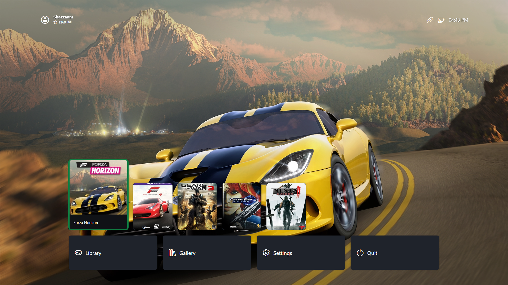

# BigScreen Mode

BigScreen is the fullscreen, controller-friendly launcher for TV / couch use. It is a separate application project (`XeniaManager.BigScreen`) sharing the same core library, library data (`Config/games.json`), and emulator installs as the desktop app.

---

## Launching and Startup Options

- **From the desktop app**: look for the BigScreen launch action (toolbar/page action depending on version).
- **Start in Big Screen** (`General → Start in Big Screen`, default off): boots straight into BigScreen instead of the desktop window. See [Manager Settings](manager-settings.md#general). Turn this on for a dedicated emulation box; keep it off while you are still configuring things, since settings editing is faster in the desktop UI.
- Exiting BigScreen returns you to the desktop (or exits entirely, depending on how it was launched).

## What You Can Do There

- Browse the same Library (artwork grid, search/sort where exposed).
- Launch games with their assigned variants - per-game settings, content, and patches apply exactly as in desktop mode.
- Basic management (content/patch/settings access depends on version - the desktop app remains the full-featured surface).
- BigScreen-exclusive views: the global **Gallery** (every screenshot from every installed variant in one grid, sortable/filterable) and the per-game **Screenshots** and **Achievements** panes in Game Details. On desktop there is no gallery viewer - right-click → View Screenshots just opens the screenshots folder (see [Content](content.md#screenshots-and-save-backups)).

Prefer the desktop app for: first-time Xenia installation, patch editing, config tuning, profile/save surgery, and Steam shortcut creation. Use BigScreen for: launching and playing.

### BigScreen settings

The Settings screen covers: library layout (Carousel/List), card artwork (BoxArt/Icon), clock format (12h/24h), UI scale (25–200%), launch behavior (return to desktop on quit, fullscreen launches, start in BigScreen), profile rotation display, background (dynamic artwork / gradient / solid / custom image, accent color, vignette), controllers (list + primary), and per-version XConfig resolution. Profile management (create/rename/configure/delete/import/export) lives behind the profile row.

> For how the BigScreen screens work internally (Dashboard, Library, navigation, modal stack), see the [BigScreen deep dive](../big-screen/overview.md).

## Tips

- Set up everything in desktop mode first (install emulators, scan library, verify one game boots), then switch to BigScreen for daily use.
- If BigScreen shows an empty library, the desktop app would too - rescan in desktop mode ([Library](library.md#scanning-and-adding-games)); both read the same `games.json`.
- Dashboard preferences persist to `Config/dashboard-settings.json` next to the other config files.

---

## Troubleshooting

- **BigScreen starts but games fail to launch** - diagnose in desktop mode where error output and logs are visible ([Troubleshooting](../help/troubleshooting.md#logs)), then return to BigScreen.
- **Controller does not navigate BigScreen** - confirm Xenia's `gamecontrollerdb.txt` is present and your controller works in the desktop app first; BigScreen relies on the same SDL mapping pipeline.
