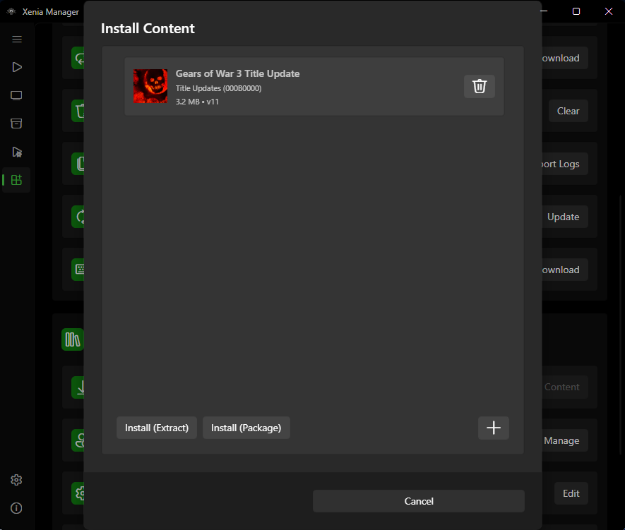
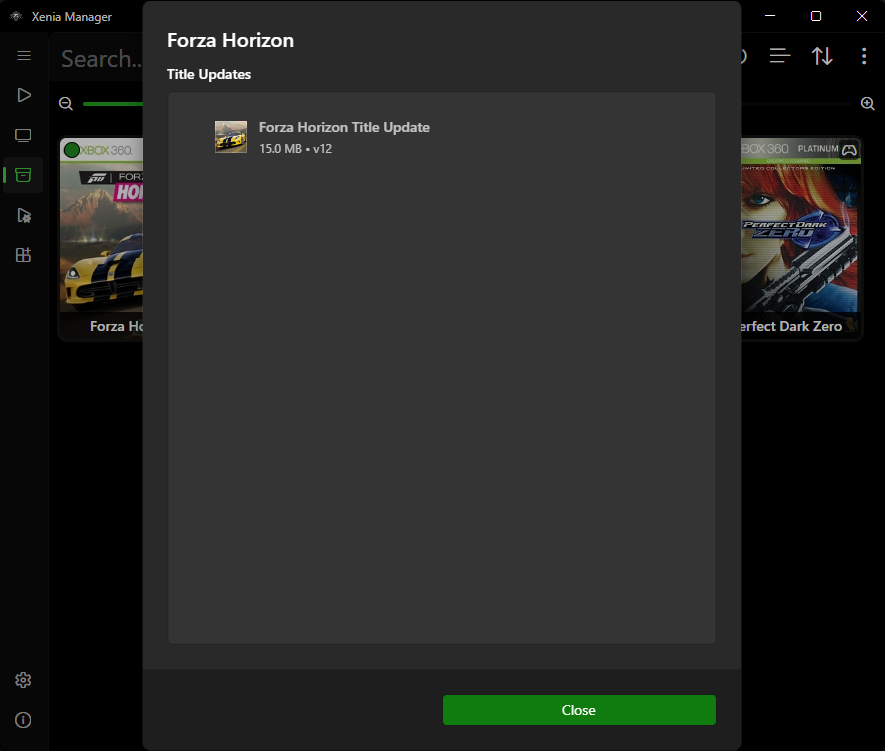
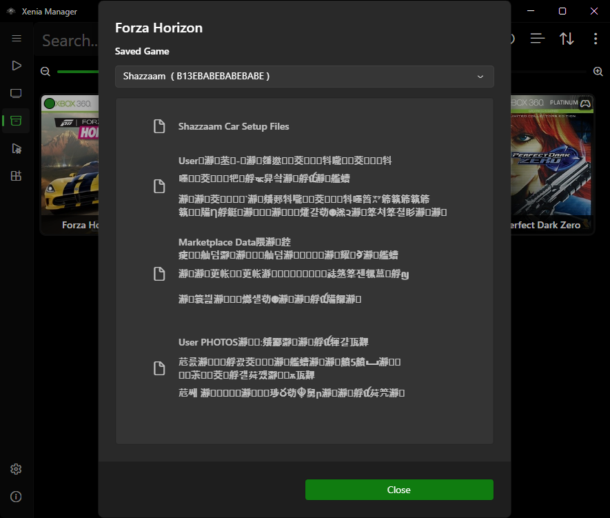
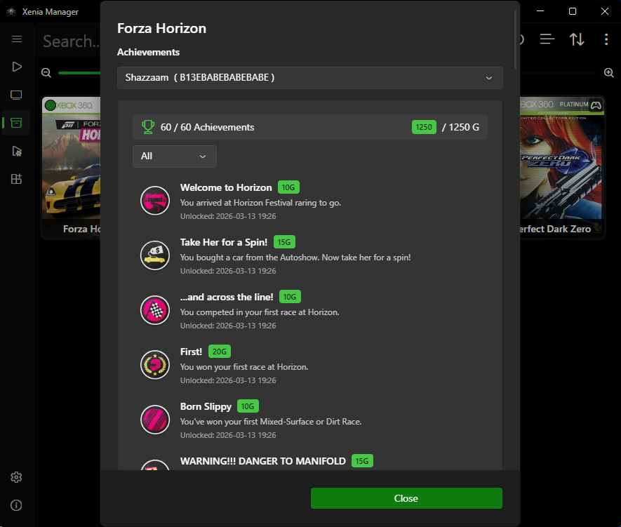

# Content (DLC & Title Updates)

Xenia Manager installs DLC and Title Updates (TU) **without launching Xenia**. It understands Xbox 360 content packages (STFS containers and related formats) and places them where the emulator expects them.

---

## Where Content Lives: Unified vs. Per-Emulator

Two modes, controlled by **Emulator → Unified content folder** ([Manager Settings](manager-settings.md#emulator)):

- **Per-emulator (default, off)**: content goes into each variant's own folder, e.g. `Emulators/Xenia Canary/content/<TitleID>/...`. Use this when different variants need different content sets.
- **Unified (on)**: content goes into `Emulators/Content/` shared by all variants. Use this to avoid storing the same 10 GB DLC three times for Canary + Mousehook + Netplay.

Switching modes does not move already-installed content — reinstall or move the folders manually, then verify in the Content Viewer.

## Installation Method: Folder vs. Package File

When installing, you choose one of two methods (stored per operation):

| Method | What it does | When to use it |
| ------ | ------------ | -------------- |
| **Extracted folder** (`Install (Extract)` button) | Extracts the package contents into Xenia's directory structure | Default. Compatible with **every** Xenia version |
| **Package file** (`Install (Package)` button) | Copies the package file into Xenia's content directory as-is | Cleaner, but unsupported builds will ignore the file |

If installed DLC does not appear in-game and you used **Package file** mode, reinstall as **Extracted folder** first — that rules out the most common cause.

---

## Installing Content

1. Select a game in the Library (content is always installed **for a specific title** — Title ID determines the destination folder).
2. Open **Install Content** (right-click → Install Content, or the Content Viewer → Install).
3. Pick the package file(s) from disk (DLC / TU containers you dumped from your own console).
4. Choose the installation method (**Extracted folder** / `Install (Extract)` unless you know your build supports package files).
5. Confirm. The Manager parses the container and copies/extracts it into the `content/<TitleID>/` tree for the selected game. It filters out non-game containers but does not strict-match DLC Title ID to the game's ID — double-check you selected the right game.
6. Launch the game — the content should be visible in-game (some titles require the latest TU before DLC unlocks).

!!! tip
    Install the **Title Update first, then DLC**. Several games refuse to load DLC when the matching TU version is missing.

## Content Viewer

The Content Viewer shows everything installed for the selected game. Each entry shows package names, sizes, thumbnails where available, and install locations. Removal deletes the content files from Xenia Manager and it's emulator's content folder; your source packages elsewhere are untouched.

=== "Title Updates"

    

    Title Update packages (`000B0000`) shared across profiles. Use it to verify the TU installed, open its folder, or delete entries without touching DLC or saves.

=== "Saved Games"

    

    Per-profile saves (`00000001`) with an account selector (Gamertag + XUID). Right-click a save to **Export** / **Import** it or open its folder. Use Export before experimenting, then Import to restore.

=== "Marketplace (DLC)"

    

    DLC, themes, and other marketplace downloads (`00000002`) shared across profiles. Use it to verify an install landed where expected, spot Title ID mismatches (content for Title ID `X` under game `Y`), or delete individual entries.

=== "Achievements"

    

    Per-profile achievements read from the game's GPD, with an account selector, unlock count, and Gamerscore header. Filter the list, then unlock/lock selected or all entries. Unlocked achievements show their image; locked ones show a lock icon.

---

## Multi-Disc and Title ID Notes

- DLC is keyed by **Title ID**, not disc. For merged multi-disc entries, install once — all discs share it.
- If two regions/editions of a game have different Title IDs, their content is **not** interchangeable. Match the DLC region to your dump's Title ID (visible in the [Details editor](library.md#game-details-editor)).
- The Manager targets the selected game's Title ID folder on install, but it cannot validate region-specific incompatibilities beyond that — when in doubt, keep DLC from the same region as the game.

---

## Troubleshooting

- **Content installed but not visible in-game** — (1) confirm you installed for the right Title ID, (2) try Extracted-folder mode, (3) install the matching TU, (4) check unified vs. per-emulator folder confusion. Full checklist: [Troubleshooting](../troubleshooting.md#dlc-or-title-update-not-visible-in-game).
- **Install fails to parse** — the source package is likely corrupt or truncated. Re-dump/re-copy it; the Manager only reads what is there.
