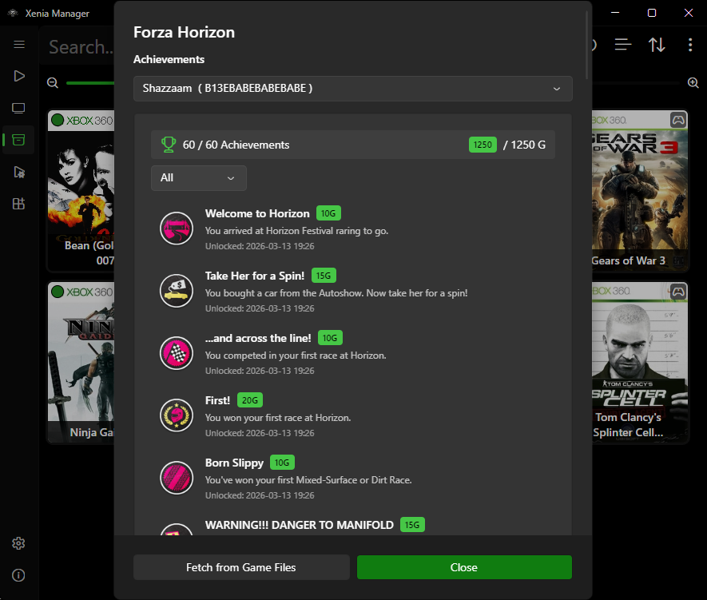

# Content (DLC & Title Updates)

Xenia Manager installs DLC and Title Updates (TU) **without launching Xenia**. It understands Xbox 360 content packages (STFS containers and related formats) and places them where the emulator expects them.

---

## Where Content Lives: Unified vs. Per-Emulator

Two modes, controlled by **Emulator → Unified content folder** ([Manager Settings](manager-settings.md#emulator)):

- **Per-emulator (default, off)**: content goes into each variant's own folder, e.g. `Emulators/Xenia Canary/content/<TitleID>/...`. Use this when different variants need different content sets.
- **Unified (on)**: content goes into `Emulators/Content/` shared by all variants. Use this to avoid storing the same 10 GB DLC three times for Canary + Mousehook + Netplay.

Switching modes does not move already-installed content - reinstall or move the folders manually, then verify in the Content Viewer.

## Installation Method: Folder vs. Package File

When installing, you choose one of two methods (stored per operation):

| Method | What it does | When to use it |
| ------ | ------------ | -------------- |
| **Extracted folder** | Extracts the package contents into Xenia's directory structure | Default. Compatible with **every** Xenia version |
| **Package file** | Copies the package file into Xenia's content directory as-is | Only on Canary builds with **XContent package support**. Faster and cleaner, but unsupported builds will ignore the file |

If installed DLC does not appear in-game and you used **Package file** mode, reinstall as **Extracted folder** first - that rules out the most common cause.

---

## Installing Content

1. Select a game in the Library (content is always installed **for a specific title** - Title ID determines the destination folder).
2. Open **Install Content** (right-click → Install Content, or the Content Viewer → Install).
3. Pick the package file(s) from disk (DLC / TU containers you dumped from your own console).
4. Choose the installation method (**Extracted folder** unless you know your build supports package files).
5. Confirm. The Manager parses the container, validates the Title ID matches the game, and copies/extracts it into the correct `content/<TitleID>/` tree.
6. Launch the game - the content should be visible in-game (some titles require the latest TU before DLC unlocks).

!!! tip
    Install the **Title Update first, then DLC**. Several games refuse to load DLC when the matching TU version is missing.

## Content Viewer

The Content Viewer shows everything installed for the selected game, split into four views - one per data type. Each lists package names, Title IDs, sizes, and install locations. Use it to:

- Verify an install actually landed where expected.
- Remove individual entries without touching the rest (**Delete All** clears the current view after confirmation).
- Spot mismatches (content for Title ID `X` installed under game `Y` - usually a wrong-file mistake).
- **Open Content Directory** reveals the underlying `{Content}/{XUID}/{TitleId}/` folder in Explorer.

Removal deletes the content files from disk; your source packages elsewhere are untouched.

=== "Saved Games"

    

    Per-profile save data for the selected game. Save import/export (`*.xsave` / `*.zip`) lives in this view - see [Profiles & Saves](profiles-saves.md#import-and-export-saves) for the full flow.

=== "Achievements"

    

    The **Achievements** view reads the game's GPD (`{TitleId}.gpd`) for the selected profile. Beyond viewing, it can pull missing data straight from your game files and toggle unlock state:

    - **Fetch Achievements from Game Files** - builds a missing `{TitleId}.gpd` (plus the profile entry in `FFFE07D1.gpd`) from the SPA data embedded in the disc. Works with ISO/XISO, SVOD, STFS, XEX, and ZAR sources. Missing entries are added; existing entries and unlock state are left untouched. Strings follow the profile's console language with fallback to the SPA default.
    - **Fetch from Game Files** - refreshes an existing GPD from the disc (multi-disc games ask which disc to read first). Pick one per run: **Missing images**, **Unlocked images only**, **Overwrite all images**, or **Achievement strings** (names/descriptions).
    - **Unlock / Lock** - toggles individual achievements (or all at once) in the GPD. Useful for testing or restoring state; takes effect next launch.

=== "Title Updates"

    

    Installed Title Update packages for the selected game. If DLC refuses to load in-game, check here first and confirm the matching TU is installed - several titles ignore DLC without it.

=== "Marketplace Content"

    

    Installed DLC packages for the selected game. DLC is keyed by Title ID and region - content from another region/edition will list here but may not unlock in-game (see [Multi-Disc and Title ID Notes](#multi-disc-and-title-id-notes)).

### Screenshots and save backups

Two related right-click actions are folder openers, not viewers:

- **View Screenshots** opens `Emulators/<Variant>/screenshots/<TitleID>/` in Explorer. If the folder does not exist yet (no screenshots taken), the Manager shows a notice instead.
- **Open Save Backup Folder** opens `Backup/<Title>/Game Saves/` in Explorer. It only exists when [automatic save backup](profiles-saves.md#manage-profiles) has run at least once.

---

## Multi-Disc and Title ID Notes

- DLC is keyed by **Title ID**, not disc. For merged multi-disc entries, install once - all discs share it.
- If two regions/editions of a game have different Title IDs, their content is **not** interchangeable. Match the DLC region to your dump's Title ID (visible in the [Details editor](library.md#game-details-editor)).
- The Manager validates Title IDs on install, but it cannot validate region-specific incompatibilities beyond that - when in doubt, keep DLC from the same region as the game.

---

## Troubleshooting

- **Content installed but not visible in-game** - (1) confirm you installed for the right Title ID, (2) try Extracted-folder mode, (3) install the matching TU, (4) check unified vs. per-emulator folder confusion. Full checklist: [Troubleshooting](../help/troubleshooting.md#dlc-or-title-update-not-visible-in-game).
- **Install fails to parse** - the source package is likely corrupt or truncated. Re-dump/re-copy it; the Manager only reads what is there.
