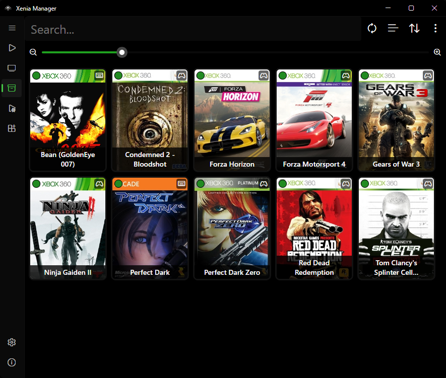
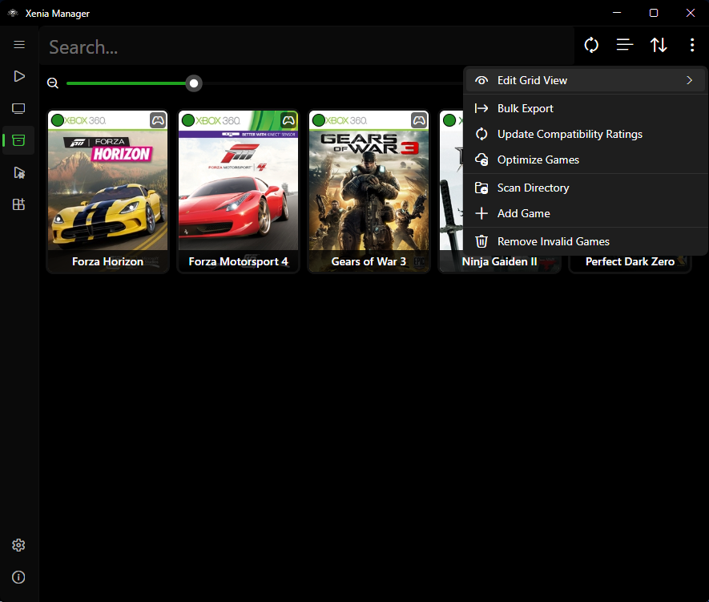
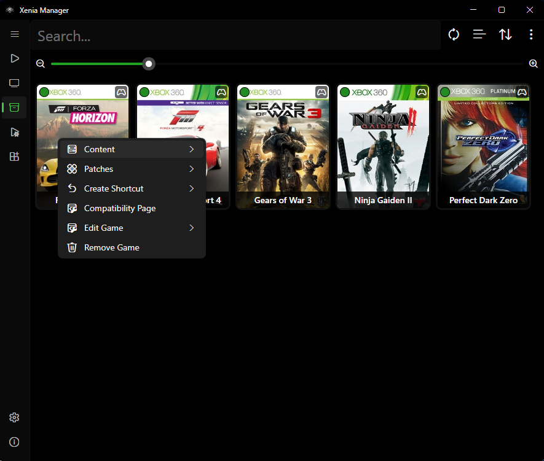
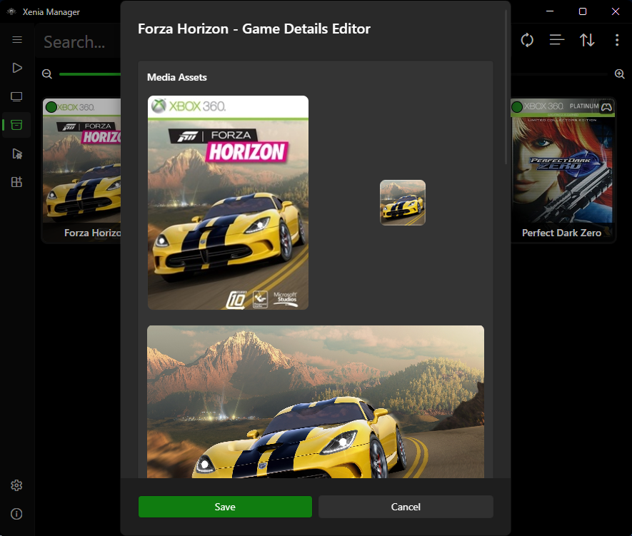
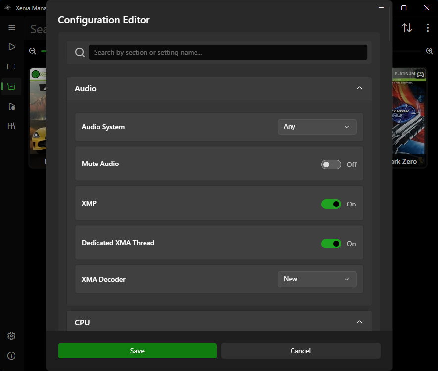

# Library

The Library page is the home screen: your scanned games, their artwork, compatibility, playtime, and every per-game action (launch, edit, content, patches, settings, shortcuts).

---

## Scanning and Adding Games

### Scan a directory

1. Go to **Library → Options** (library toolbar).
2. Choose **Scan directory** and pick the folder containing your dumps.
3. The Manager walks the folder, parses each candidate with its built-in Xbox/Xenia file parsers (ISO, XEX, STFS/SVOD containers, GPD metadata, ZAR archives, and related formats), extracts Title ID / Media ID, and queries the title database.
4. New games are appended to `Config/games.json`. Artwork is resolved in this order:
    1. Embedded artwork from the game file itself (XDBF SPA icon, e.g. `0x8000`) when `Use embedded artwork` is on (default).
    2. Downloaded artwork from the marketplace database (`x360db`), cached under `Cache/Database/x360db/` and `Cache/Images/`.

### Auto-detect and multi-disc

- **Auto-detect new games** (on by default): when files appear in your games directory, the Manager can pick them up without a manual rescan. A notification with a rescan action appears (short cooldown to avoid spam). Toggle in [Manager Settings](manager-settings.md#library-behaviour).
- **Multi-disc games**: when two entries share a title but differ by disc (Media IDs), the Manager asks whether to merge them into one entry with a disc picker. Enable **Auto-merge multi-disc** to skip the prompt in the future.
- The merged entry remembers `last_played_disc` - the disc-selection popup pre-selects the disc you launched last time.

### What is stored per game

Each entry in `games.json` tracks:

- `game_id` (Title ID) and `media_id`, plus `alternative_id` list used for compatibility lookups
- `title` (uses Media ID for title matching when `Use MediaId for title` is on)
- `xenia_version` - which emulator variant this game launches with (Canary / Mousehook / Netplay / Custom)
- `compatibility` - cached rating from the compatibility database
- `artwork` - paths to box art / icons
- `file_locations` - game file, config, patch paths
- `playtime` (hours), `last_played` timestamp, `last_played_disc`

---

## Views, Sorting, and Search

Toggle between **Grid view** (artwork tiles) and **List view** (table) from the Library toolbar. Your choice persists.

### Grid view options

Configurable in [Manager Settings](manager-settings.md#library-views):

- Show/hide game title on the tile (default: shown)
- Show/hide compatibility rating badge (default: shown)
- Show/hide Xenia version badge (default: hidden - useful when you mix Canary/Mousehook/Netplay per game)
- Zoom level for tile size
- Double-click tile to launch (off by default; when off, double-click opens details/selection instead)

### List view columns

Toggle each column in settings: compatibility rating, playtime, Xenia version, last played, game icon, Title ID, Media ID.

### Sort and filter

- Sort by title, playtime, last played, compatibility, and similar options; flip ascending/descending from the toolbar.
- Use the search box to filter by title or Title ID. Sorting applies to the filtered set.

---

## Right-Click Menu (Per-Game Actions)

Typical entries (availability depends on game state):

- **Launch** - start the game with its assigned Xenia version. For multi-disc games, pick the disc first.
- **Game Details Editor** - fix title, IDs, artwork (see below).
- **Game Settings Editor** - per-game Xenia config overrides (see [Xenia Settings](xenia-settings.md#global-vs-per-game-settings)).
- **Content Viewer** - separate views for Saved Games, Achievements, Title Updates, and Marketplace Content (see [Content](content.md#content-viewer)). Plus **View Screenshots** (opens `Emulators/<Variant>/screenshots/<TitleID>/` in Explorer; shows a notice when none exist) and **Open Save Backup Folder** (opens `Backup/<Title>/Game Saves/`, only when automatic backups exist).
- **Install Content** - DLC and Title Updates (see [Content](content.md)).
- **Patches** - Download, Install Local (`.toml` file), Add Additional, Configure, Export, and Remove (see [Patches](patches.md)).
- **Mousehook Controls Editor** - only meaningful for Mousehook-assigned games (see [Mousehook](mousehook.md)).
- **Create Desktop Shortcut / Create Steam Shortcut** - see [Steam Shortcuts](steam-shortcuts.md). Both are Windows-only and ask for a disc first on multi-disc games.
- **Open Compatibility Page** - opens the compatibility database URL for the game when one is known.
- **Manage Discs** - add, remove, or relabel discs in a merged multi-disc entry (changes save to `games.json`).
- **Open folder / Reveal files** - jump to the game file, config, or emulator folder.
- **Remove from library** - drops the entry from `games.json`. A second prompt asks whether to also delete the game's installed content; your game files themselves are never deleted.

Multi-select is supported for bulk operations; the toolbar shows the selected-games count.

### Library toolbar extras

Beyond scan/add/remove, the Library toolbar offers:

- **Drag and drop** - drop `.iso` / `.xex` / `.zar` files directly onto the Library to add them (same pipeline as Add Game, including the Xenia-version picker for multi-variant setups).
- **Export shortcuts** - bulk-create desktop `.lnk` files (folder picker) or Steam shortcuts for every selected game at once.
- **Update compatibility ratings** - re-fetch ratings from the databases, with a picker for which set to refresh (game, Mousehook, Netplay).
- **Update optimized settings** - bulk-apply community optimized settings to all per-game configs at once.
- **Remove invalid games** - prune entries whose files no longer exist on disk.

### Compatibility ratings

The badge colors map to these ratings: **Unknown**, **Unplayable**, **Loads**, **Gameplay**, **Playable**. Mousehook-assigned games additionally show the Mousehook support rating, and Netplay games show Netplay status rows (public/tested-local/only-local/system-link). Ratings are advisory - hardware and game revision matter.

---

## Game Details Editor

Use this when a scan misidentifies a game or artwork is missing:

- **Title** - display name in the Library. Fix typos or regional naming here.
- **Title ID / Media ID / Alternative IDs** - identifiers used for database lookups. Only change these if you know the correct IDs; wrong IDs break compatibility, artwork, and patch matching. Prefer re-scanning with `Use MediaId for title` toggled (see [Manager Settings](manager-settings.md#library-behaviour)) before hand-editing IDs.
- **Artwork** - replace or refresh box art / icons. The Manager re-caches under `Cache/Images/`.
- **Xenia version** - which variant launches this game. Change here instead of globally when only one game needs Mousehook or Netplay.

Changes save back to `games.json` immediately.

## Game Settings Editor

This edits the **per-game configuration profile**: overrides that apply only to this title, leaving the global emulator config untouched. Typical uses:

- Graphics or audio fixes that only one game needs.
- Performance tweaks (resolution scale, vsync, etc.) per title.
- Assigning a different Xenia variant or config file to this game.

The editor works on the same dynamic config model as the global [Xenia Settings](xenia-settings.md) page - every field maps to a real key in the game's `.toml` config. Delete an override to fall back to the global value.

---

## Unknown Games

### Game shows as "Unknown Game"

1. Verify the dump is complete and not corrupted (re-dump or re-copy if the file is truncated).
2. Try toggling **Parse game details with Xenia** in [Manager Settings](manager-settings.md#library-behaviour) - for some formats, launching Xenia's own parser extracts titles the fast parser misses.
3. Toggle **Use MediaId for title** and rescan.
4. As a last resort, open the **Game Details Editor** and fill in the title and IDs manually, then use **Refresh artwork**.

If the file itself will not parse at all, Xenia would not boot it either - fix the dump first.

---

## Tips

- Keep one folder per game disc and avoid renaming files inside extracted containers; the parsers rely on internal headers, not filenames.
- After moving your games folder on disk, rescan the new location and remove stale entries - stored file paths are absolute.
- Back up `Config/games.json` before bulk edits; it is a plain JSON file and easy to restore.
