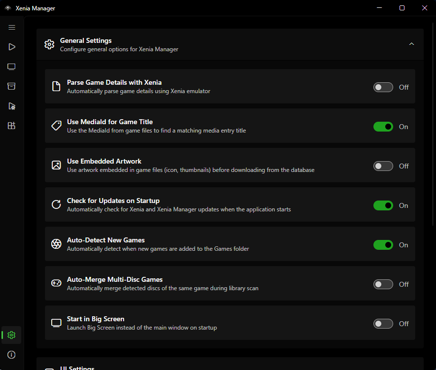
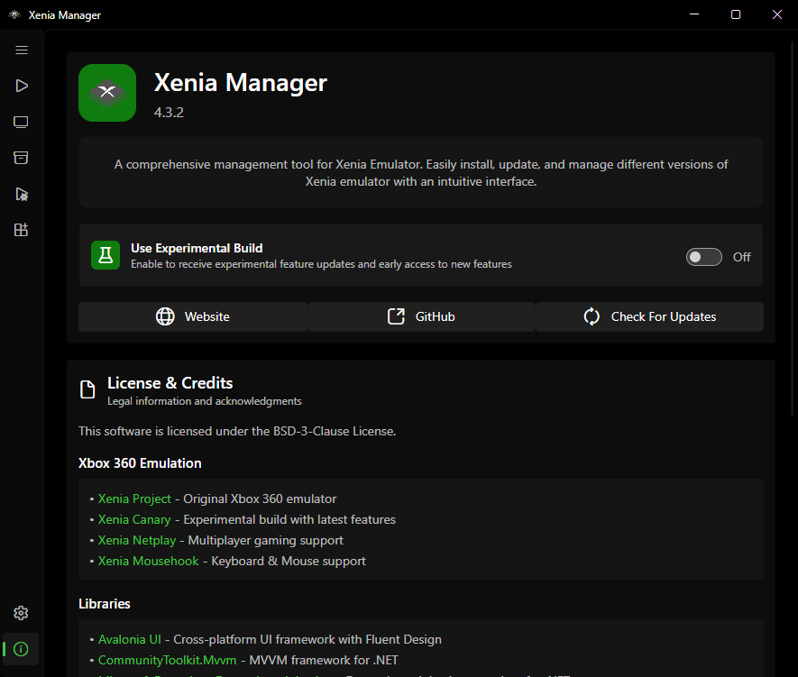

# Manager Settings

The Settings page configures Xenia Manager itself (not the emulator — that is [Xenia Settings](xenia-settings.md)). Settings persist to `Config/config.json` (with an automatic `config.json.backup`).

---

## General

| Setting | Default | What it does |
| ------- | ------- | ------------ |
| Parse game details with Xenia | off | Use Xenia's own parser for title extraction during scans. Slower but rescues some formats the fast parser misses. Try it when scans yield "Unknown Game" |
| Use MediaId for title | on | Match titles by Media ID rather than Title ID alone. Leave on unless a specific game mismatches |
| Auto-detect new games | on | Pick up files added to the games directory without a manual rescan |
| Auto-merge multi-disc | off | Merge detected multi-disc sets silently instead of asking each time |
| Start in Big Screen | off | Boot into [Bigscreen mode](bigscreen.md) instead of the desktop window |
| Use embedded artwork | on | Prefer the icon embedded in the game file (XDBF SPA `0x8000`) before downloading artwork |

## User Interface

Appearance, language, and window behaviour:

=== "Theme"

    Five built-in themes: **System** (follows the OS), **Light** (default), **Dark**, **Amoled** (true-black dark for OLED screens), **Steam** (Steam-inspired styling).

    Custom themes: copy `source/XeniaManager/Resources/Themes/Template.axaml` to a new file, recolor it (keep all `x:Key` names), add the name to the `Theme` enum (`source/XeniaManager.Core/Models/Theme.cs`) and the `switch` in `ThemeService.cs` — full steps are in the main repo's Contributing Guide and summarized in [Development](../development.md#themes).

=== "Language"

    The UI language selector. Translation files live in `source/XeniaManager/Resources/Language/` (`en.axaml` is the template; copy to `<code>.axaml` for a new language). To contribute a translation, follow the main repo's Translations Guide (summarized in [Development](../development.md#translations)) — do not hand-edit the in-code `SupportedLanguages` list; maintainers wire that up at release time.

=== "Window"

    

    - Window position/size/state are remembered across launches.
    - **Loading screen** (on by default): shows a splash while a game boots. Disable it if you prefer to see Xenia's window immediately.

## Library Views

Detection toggles live under General above — the tabs below control presentation only:

=== "Grid view"

    Tile options:

    - Show game title on tile (default on)
    - Show compatibility badge (default on)
    - Show Xenia version badge (default off — turn on when mixing variants)
    - Zoom level (tile size)
    - Double-click tile launches the game (default off)

=== "List view"

    Choose which columns appear: compatibility rating, playtime, Xenia version, last played, game icon (all default on); Title ID and Media ID (default off — enable when diagnosing patch/content mismatches).

=== "Sorting"

    Pick the sort key and direction (ascending/descending). Applies to the Library page ordering; search filtering composes with it.

## Emulator

Where content lives, how profiles are handled, and which build channel each variant follows:

=== "Unified content"

    Unified content folder (default off). When on, DLC/TU install to `Emulators/Content/` shared across variants instead of each variant's `content/` folder. See [Content](content.md#where-content-lives-unified-vs-per-emulator).

=== "Profile"

    - **Automatic save backup** (default off) — snapshot profile saves automatically. See [Profiles & Saves](profiles-saves.md#manage-profiles).
    - **Profile XUID** (default `"0"`) — ID stamped on saves. See [Profiles & Saves](profiles-saves.md#concepts). Do not change casually.

=== "Channels"

    Stable vs. nightly toggles and installed versions are managed on the [Manage Xenia page](manage-xenia.md#stable-vs-nightly), not here — they are listed here only because the values persist in the same `config.json`.

## Updates

| Setting | Default | What it does |
| ------- | ------- | ------------ |
| Check for updates on startup | on | Check Manager + emulator versions against the manifest on launch; badge pages when updates exist |
| Use experimental build | off (on in experimental builds) | Track preview/experimental Manager releases instead of stable |

When **Manager update available** is flagged, follow the prompt or reinstall from the releases page (see [Installation](../installation.md#updating-xenia-manager)). Emulator updates are applied per variant on the [Manage Xenia page](manage-xenia.md#updates).

---

## About Page

Shows the Manager version, links to releases/issues/wiki, license (BSD-3), and credits for contributors, translators, research references, and libraries. Use the version string here verbatim when filing bug reports.

---

## Config File Reference

- `Config/config.json` — all of the above. Human-readable JSON; safe to back up, and safe to hand-edit while the Manager is **closed** (it is re-read on startup).
- `Config/config.json.backup` — automatic backup of the last known-good settings.
- `Config/games.json` — the Library (see [Library](library.md#what-is-stored-per-game)).
- `Config/dashboard-settings.json` — Bigscreen/dashboard preferences.
