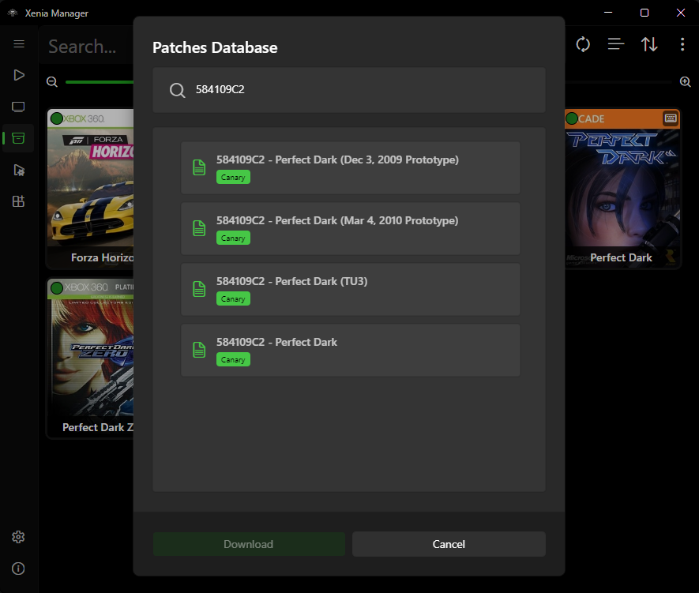
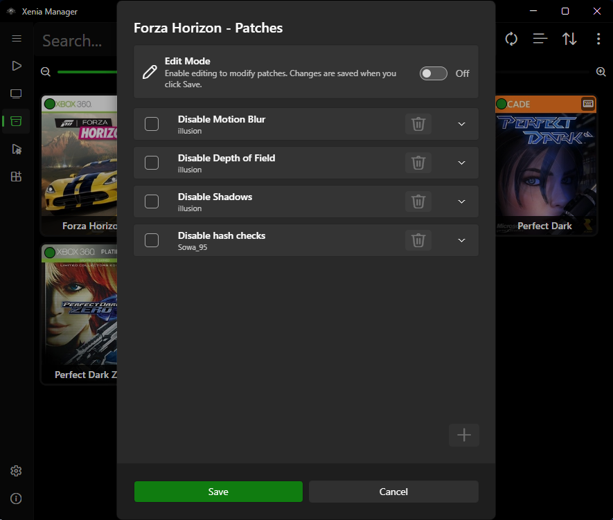

# Patches

Game patches (60 FPS mods, bug fixes, enhancements, Netplay compatibility patches) come from two community databases and are managed per game. Xenia Manager downloads them and lets you add, edit, and remove entries in one unified window — including duplicate patch names for different patch versions.

---

## Patch Sources

| Database | Used by | Upstream |
| -------- | ------- | -------- |
| Canary patches | Xenia Canary and Mousehook | [Canary patch collection](https://github.com/xenia-canary/game-patches) (mirrored through the Manager database) |
| Netplay patches | Xenia Netplay | [Netplay patch collection](https://github.com/AdrianCassar/Xenia-WebServices/tree/main/patches) (mirrored through the Manager database) |

The Manager caches the patch lists under `Cache/Database/Patches/` and refreshes them from the network. Patch files land in the variant's `patches/` folder (e.g. `Emulators/Xenia Canary/patches/` as `.patch.toml` files). Only patches in the folder of the variant the game actually launches with take effect.

!!! note
    Canary patches do not automatically apply to Netplay and vice versa. If you switch a game from Canary to Netplay, re-download that variant's patch set.

## Patches Database (Downloader)

1. Select a game in the Library.
2. Open the **Patches Database** (right-click → Patches → Download).
3. The list shows patches published for that game's Title ID / Media ID. Select the ones you want.
4. Download. Files are written to the correct variant's `patches/` folder.

If no patches are listed, none are published for that title in the selected variant's database — the Configurator below is still available for hand-written patches.

## Patches Dialog (Configurator)

The Patches dialog (`{Title} - Patches`, opened via right-click → Patches → Configure) is the per-game patch manager:

- **Enable/disable** individual patches (disabled entries stay on disk but are ignored by Xenia).
- **Add** a new patch from a `.patch.toml` file or by pasting patch text.
- **Edit** an existing patch (version pinning, addresses, notes). Useful when a patch update breaks a specific game version and you want to keep the old one.
- **Remove** patches you no longer want.
- Distinct names like "60 FPS v1" vs "60 FPS v2" can coexist, but identical names (case-insensitive) are skipped when merging patch files.

Changes apply the next time the game launches; no emulator restart beyond relaunching the game is needed.

---

## Matching Rules (Why a Patch May Not Appear)

Patches match on **Title ID (or Alternative IDs)**, with a hash check when merging files. Media IDs are stored in `.patch.toml` but are not enforced for download matching; file matching uses Title ID substring. Common reasons a patch you expect is missing:

- The patch was published for different hashes / a different Title ID revision than your dump. Check your IDs in the [Details editor](library.md#game-details-editor).
- You are looking at the wrong variant's database (Canary list vs. Netplay list).
- The local patch cache is stale — refresh/re-download the list.

## Tips

- Enable one gameplay-altering patch at a time when testing (e.g. 60 FPS + enhancement packs can interact).
- Keep the downloader's versions and your prospective [optimized settings](xenia-settings.md#optimized-settings-community-presets) in sync — some optimized presets assume a specific patch is active, and vice versa.
- Back up hand-edited `.patch.toml` files before updating the whole set; the downloader may overwrite same-named files.
