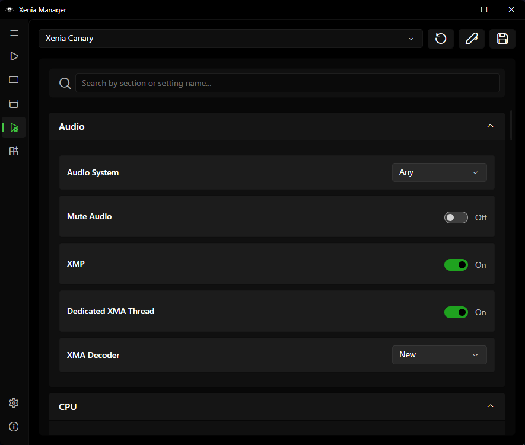
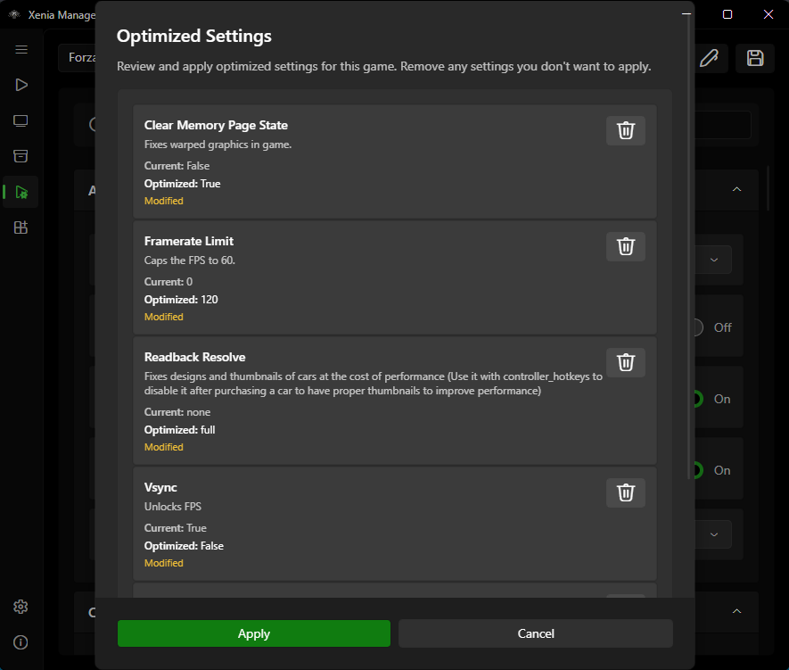

# Xenia Settings

Xenia's configuration is a large `.toml` file whose keys change between builds. Instead of hardcoding a settings form, Xenia Manager **reads the structure of your installed build's config file and builds the UI dynamically** - so the page always matches the emulator you actually have.

---

## Global vs. Per-Game Settings

| Level | Where | Affects |
| ----- | ----- | ------- |
| **Global** (this page) | The variant's active config (`Emulators/<Variant>/config/<name>.config.toml`) | Every game launched with that variant |
| **Per-game** | [Game Settings Editor](library.md#game-settings-editor) (right-click → Settings) | Only that title; overrides global values |

Workflow: get the game working with per-game overrides first, then promote values to global only when you are sure every game benefits. Deleting a per-game override falls back to the global value.

## Using the Page

1. Pick the emulator variant at the top (Canary / Mousehook / Netplay) in order to change default settings (settings that will be used by games when they are added) or pick the game you want to eddit settings for. The form rebuilds for that build's config keys.
2. Browse categories (display, GPU, audio, input, storage, etc.). Every control maps to a real `.toml` key - hovering/tooltips show the key where available.
3. Change values; they save to the variant's config file.
4. Launch the game or emulator.

The file picker at the top lists emulator configs first, then per-game titles. **Save** writes the file, **Reset** restores defaults, **Optimize** (game configs only) opens community presets, and **Open in Editor** shells out to your text editor with a Notepad fallback.

!!! warning
    Hand-editing the `.toml` in a text editor while the Manager is open can conflict with the dynamic UI - the Manager may overwrite your edits on save. When you use `Open In Editor` option, after making your edits and saving, close the editor and reselect your game (select some other config in the dropdown at the top and then select your previously selected config that you edited in editor in order for UI to update).

---

## Optimized Settings (Community Presets)

The [optimized-settings](https://github.com/xenia-manager/optimized-settings) database ships community-tested configurations per title:

1. Select a game (or open its per-game editor).
2. If a preset exists for its Title ID, the page offers it.
3. Preview what keys the preset changes, then **Apply**. The values are written as per-game overrides (global config untouched).
4. Test in-game. If the preset is worse for your hardware, revert the overrides individually or clear them to fall back to global.

Presets are cached under `Cache/Database/` and refreshed from the network. They are starting points, not guarantees - GPU vendor, driver version, and game revision all matter.

---

## Config Files Reference

Per variant (see [Manage Xenia](manage-xenia.md#emulator-folder-layout)):

- `Emulators/<Variant>/<name>.config.toml` - default config that Xenia Manager constantly swaps and is loaded by Xenia emulator.
- `Emulators/<Variant>/config/<name>.config.toml` - active config the Manager edits.
- Per-game overrides - stored alongside the game entry and merged at launch.

If settings behave unexpectedly (values "resetting" themselves), check whether you are editing the **global** page while a **per-game override** for the same key exists - the override wins at launch and makes the global edit look ignored.

---

## Troubleshooting

- **Settings page is empty or errors** - the variant is probably not installed or its config file is missing/corrupt. Reinstall or Repair that variant on the [Manage page](manage-xenia.md).
- **A setting from a guide does not exist on my page** - guides go stale as Xenia renames keys. Your dynamic UI shows what your build actually supports; update the emulator to get newer keys.
- **Game ignores my change** - confirm you edited the right level (global vs. per-game) and the right variant (the game may launch with Mousehook while you edited Canary).
